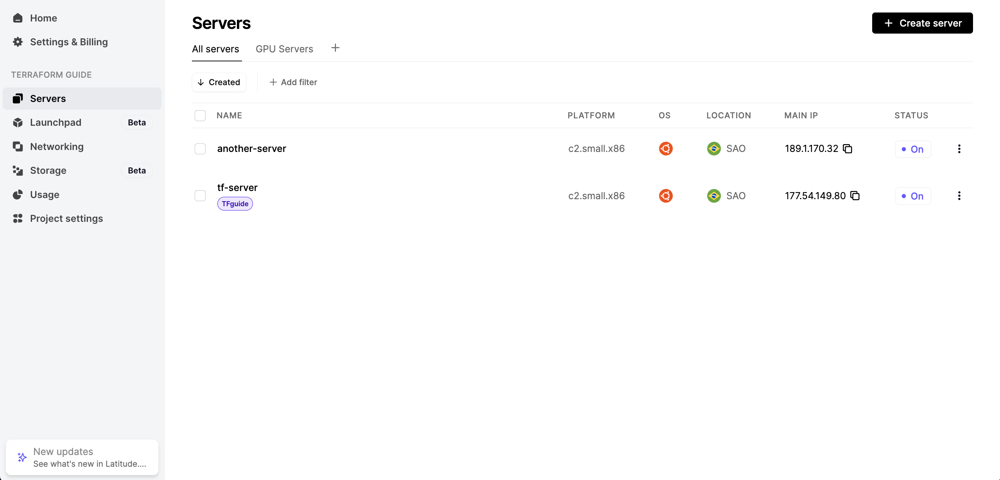
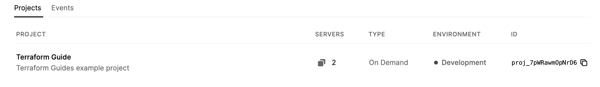
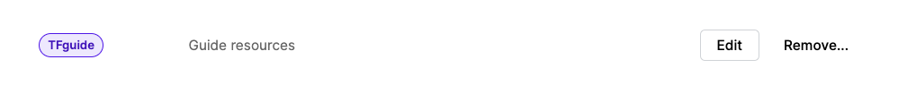
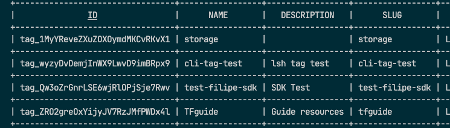
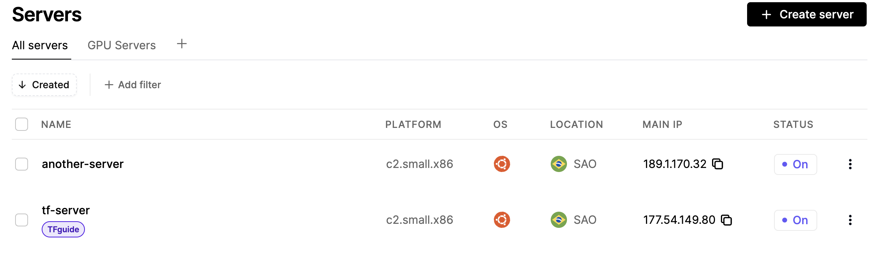

# Import your infrastructure into Terraform

Terraform is currently the most widely used Infrastructure as Code (IAC) tool. Utilizing it brings numerous advantages to managing your infrastructure. You can learn more about it at [Terraform](https://www.terraform.io/).

## Terraform State
Before starting to migrate your infrastructure, it pays off to understand how Terraform keeps track of your managed infrastructure.

Terraform will map the attributes and metadata of your resources to its internal state and save it to a local file named terraform.tfstate. Every change to a .tf file will be compared with the Terraform state file to determine what changes need to be made.

You can see an example of a .tfstate file bellow:

```json
# terraform.tfstate
{
  "version": 4,
  "terraform_version": "1.8.2",
  "serial": 20,
  "lineage": "",
  "outputs": {},
  "resources": [
    {
      "mode": "managed",
      "type": "latitudesh_project",
      "name": "guide_project",
      "provider": "provider[\"registry.terraform.io/latitudesh/latitudesh\"]",
      "instances": [
        {
          "schema_version": 0,
          "attributes": {
            "created": "2024-05-08T22:16:58+00:00",
            "description": "Terraform Guides example project",
            "environment": "Development",
            "id": "proj_7pWRawmOpNrD6",
            "name": "Terraform Guide",
            "tags": [],
            "updated": "2024-05-09T15:20:57+00:00"
          },
          "sensitive_attributes": [],
          "private": ""
        }
      ]
    }
  ],
  "check_results": null
}
```
Editing the state file directly is discouraged. Terraform will automatically modify it to reflect your current infrastructure by automatically running a `terraform refresh` command before any `terraform plan` usage. However, if you need more advanced state management, you can use the Terraform CLI terraform state command to edit it in a more controlled environment.

## Migrating your existing Infrastructure
If you already have infrastructure deployed with us, migrating to Terraform is straightforward. Let's walk through an example:




## Installing Terraform
To begin using Terraform, you'll need to install it following the official documentation: [Get Terraform](https://developer.hashicorp.com/terraform/install?product_intent=terraform).

### Creating the .tf file
To start the migration of our infrastructure, let's initialize a Terraform project in a new folder:

```bash
# create a new folder
mkdir my-infra && cd my-infra

# create main file
touch main.tf 
```
In our main file, we need to set the provider and it's version:

```bash
# main.tf
terraform {
  required_providers {
    latitudesh = {
      source  = "latitudesh/latitudesh"
      version = "1.1.0"
    }
  }
}
```

Now we can initialize terraform to download the Latitude.sh plugin and start managing our infrastructure:

```bash
terraform init
```

Before we start importing our infrastructure, we need to export our Auth Token so Terraform can communicate with the Latitude.sh API and access our resources:

```bash
export LATITUDESH_AUTH_TOKEN=<YOUR-AUTH-TOKEN>
```

Now that we're all set up, we can start importing the infrastructure

## Importing

Let's exemplify the import process with a `Project` resource.

To begin we'll need an `import` block that has two attributes
- to: The resource defined inside Terraform that will be used to manage your infrastructure.
- id: The id of your already existing infrastructure.

You can verify the id of the project in your Home at the Dashboard:



Now let's create the file for importing this project:

```bash
# projects.tf
import {
    to = latitudesh_project.guide_project
    id = "proj_7pWRawmOpNrD6"
}

resource "latitudesh_project" "guide_project" {
    name = "Terraform Guide"
    environment = "Development"
}
```

You'll notice that we have set both the name and the environment of the Project resource, this is needed because both of them are required attributes. Running `terraform plan` now should render something like this:

```bash
latitudesh_project.guide_project: Preparing import... [id=proj_7pWRawmOpNrD6]
latitudesh_project.guide_project: Refreshing state... [id=proj_7pWRawmOpNrD6]

Terraform used the selected providers to generate the following execution plan. Resource actions are indicated with the following symbols:
  ~ update in-place

Terraform will perform the following actions:

  # latitudesh_project.guide_project will be updated in-place
  # (imported from "proj_7pWRawmOpNrD6")
  ~ resource "latitudesh_project" "guide_project" {
        created     = "2024-05-08T22:16:58+00:00"
      - description = "Terraform Guides example project" -> null
        environment = "Development"
        id          = "proj_7pWRawmOpNrD6"
        name        = "Terraform Guide"
        tags        = []
        updated     = "2024-05-08T22:20:09+00:00"
    }

Plan: 1 to import, 0 to add, 1 to change, 0 to destroy.
```
Here you'll notice that there's a "-" signal before the description. That occurs because we haven't defined a description attribute in our project resource block. to avoid updating the resource we will add the missing attribute to our resource.

```bash
# projects.tf
import {
    to = latitudesh_project.guide_project

    id = "proj_7pWRawmOpNrD6"
}

resource "latitudesh_project" "guide_project" {
    name = "Terraform Guide"
    description = "Terraform Guides example project"
    environment = "Development"
}
```

Now we can run `terraform apply` to import the resource:

```bash
latitudesh_project.guide_project: Preparing import... [id=proj_7pWRawmOpNrD6]
latitudesh_project.guide_project: Refreshing state... [id=proj_7pWRawmOpNrD6]

Terraform will perform the following actions:

  # latitudesh_project.guide_project will be imported
    resource "latitudesh_project" "guide_project" {
        created     = "2024-05-08T22:16:58+00:00"
        description = "Terraform Guides example project"
        environment = "Development"
        id          = "proj_7pWRawmOpNrD6"
        name        = "Terraform Guide"
        tags        = []
        updated     = "2024-05-08T22:20:09+00:00"
    }

Plan: 1 to import, 0 to add, 0 to change, 0 to destroy.

Do you want to perform these actions?
  Terraform will perform the actions described above.
  Only 'yes' will be accepted to approve.

  Enter a value:
```

And it's done! You can now manage this resource with Terraform.

Now let's import some other resources.
To every latitude.sh resources and how to define them you can read our [Terraform Registry documentation](https://registry.terraform.io/providers/latitudesh/latitudesh/latest/docs).

### Resources IDs
As we've seen in the process of importing resources, it's necessary to pass the ID of the resource to the import block. One of The fastest and most straightforward ways to obtain the IDs is by using our CLI. 

To learn how to set up the CLI, you can visit our [Latitude.sh CLI documentation page](https://docs.latitude.sh/docs/cli).

After installation, you can use the `lsh` command in your terminal to access your infrastructure.

Let's see an example of how to get the ID of a resource:



Here, we have a tag resource. By running lsh tags list, you will see a table with all your tags:



You'll be able to get the ID from the 'ID' column and use it in the import block.

### Importing using for_each

We have two servers created which we can import using Terraform's for_each syntax:



Create the following file:

```bash
# servers.tf
locals {
  servers = {
    "tf-server" = {
        id = "sv_6B9VaLJmZN7vr",
        project = latitudesh_project.guide_project.id
        operating_system = "ubuntu_22_04_x64_lts"
        site = "SAO"
        plan = "c2-small-x86"
        tags = [ "tag_mQ1EM1yJ6XIYlO1DKxXpIdevjPP" ]
    },
    "another-server" = {
        id = "sv_7pWRawQkENrD6"
        project = latitudesh_project.guide_project.id
        operating_system = "ubuntu_22_04_x64_lts"
        site = "SAO"
        plan = "c2-small-x86"
        tags = []
    },
  }
}

import {
  for_each = local.servers
  id = each.value.id
  to = latitudesh_server.server[each.key]
}

resource "latitudesh_server" "server" {
  for_each = local.servers
  hostname = each.key
  project = each.value.project
  operating_system = each.value.operating_system
  site = each.value.site
  plan = each.value.plan
}
```
Here we've defined the server attributes as a local value object. Then we use the `for_each` keyword to loop over the objects and get their key-value pair to build our resource. Running terraform apply should import the servers successfully.

### Generating Configuration
Terraform allows us to generate the resource based on our import block. Let's try to import the rest of our infrastructure.

```bash
# import.tf
import {
    to = latitudesh_virtual_network.vlan
    id = "proj_7pWRawmOpNrD6:vlan_dexA0qj36NlQV"
}

import {
    to = latitudesh_vlan_assignment.vlan_assignment
    id = "proj_7pWRawmOpNrD6:vnasg_Yx2za1g9KNVrL"
}

import {
    to = latitudesh_ssh_key.sshkey
    id = "proj_7pWRawmOpNrD6:ssh_MDEOaPmyq0wgB"
}

import {
    to = latitudesh_user_data.user_data
    id = "proj_7pWRawmOpNrD6:ud_owPOapbdNB4xr"
}

import {
    to = latitudesh_tag.guide_tag
    id = "proj_7pWRawmOpNrD6:tag_mQ1EM1yJ6XIYlO1DKxXpIdevjPP"
}
```

The ids here are in the form of "projectID:resourceID". This is needed for nested resources. At our [Terraform Registry documentation](https://registry.terraform.io/providers/latitudesh/latitudesh/latest/docs), you can verify if a resource is a nested resource or not.

To automatically generate the resource blocks, run:
```bash
terraform plan -generate-config-out=generated_resources.tf
```

This will generate a `generated_resources.tf` file with the resource blocks of the remaining infrastructure. Generating configuration is still an experimental feature, and it's highly encouraged for you to verify the generated resources. 

You can edit and organize each resource in a different file if you want. When you're finished verifying the generated resources, you can run `terraform apply` to finish your configuration.

Now you know everything needed to migrate your infrastructure to Terraform. Congratulations!